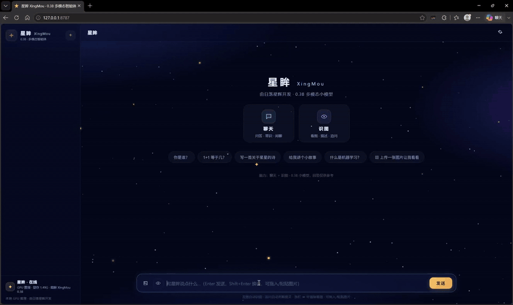

# 星眸 XingMou（NovaMind-VL）· 0.3B 多模态语言模型与本地智能体

<div align="center">

**一个从零训练、能聊天、能识图的 0.3B 多模态小模型，以及它的本地网页智能体**

[PyTorch](https://pytorch.org/) 原生实现 · 全链路训练代码开源 · 单卡 V100 可训 · RTX 4060 8G 可跑

</div>

<div align="center">
  
  <p><sub>演示</sub></p>
</div>

---

## 项目简介

NovaMind-VL（产品名：星眸 XingMou）是一个从零实现的 **0.3B 多模态语言模型** 项目，
完整走通「**分词器 → 预训练 → 监督微调（SFT）→ LoRA → DPO 偏好对齐 → 视觉多模态 →
本地部署**」的全链路，并将模型产品化为一个本地运行的网页智能体。

## 核心能力

- 💬 中文聊天：问答 / 常识 / 闲聊
- 🖼️ 图像理解：主体 / 场景 / 颜色 / 大字招牌识别
- 🧠 图文自动路由：文本与视觉问题自动分流到对应模型
- 🗂️ 多会话管理：自动标题、历史列表、重启不丢（会话落盘）

## 能力边界

0.3B 参数量决定了能力的上限，如实说明：

- 聊天：常识 / 算术 / 闲聊可用，复杂推理受限
- 识图：主体、场景、颜色、大字可辨，小字密集 OCR 受限

## 模型规格

| 项 | NovaMind-0.3B |
|---|---|
| 词表 | 32000（ByteLevel BPE） |
| 隐藏宽度 / 层数 | 1024 / 24 |
| 注意力 | 16 Q 头 + 4 KV 头（GQA） |
| 前馈 | SwiGLU（2816） |
| 归一化 / 位置编码 | RMSNorm / RoPE（θ=1e6） |
| 上下文长度 | 2048 |
| 参数量 | 约 303M（权重绑定 lm_head） |
| 视觉 | 冻结 SigLIP2-256 + 两层 MLP Projector |

## 目录结构

```
├── novamind/                 # 核心代码包（PyTorch 原生实现，不依赖 transformers 抽象）
│   ├── config.py             #   模型配置与参数量估算
│   ├── tokenizer.py          #   BPE 分词器（教学版 + tokenizers 训练版）
│   ├── model.py              #   RMSNorm / RoPE / GQA / SwiGLU / MoE / CausalLM + KV Cache
│   ├── dataset*.py           #   预训练 / SFT / DPO / VLM 数据集（packing + 掩码）
│   ├── lora.py               #   LoRA 参数高效微调
│   ├── vision_model.py       #   视觉塔：冻结 SigLIP + 可训练投影层
│   └── vlm_utils.py          #   <|image|> 词表扩展 + 图像特征拼接
├── train/                    # 训练脚本（分词器 / 预训练 / SFT / LoRA / DPO / VLM 两阶段）
├── serve/                    # 星眸本地智能体
│   ├── agent.py              #   双模型路由 + 自动图文分流 + 会话持久化 + 流式生成
│   ├── server.py             #   FastAPI：网页 + SSE 流式 + OpenAI 兼容接口
│   ├── web/                  #   星夜主题前端（原生 HTML/CSS/JS，零依赖）
│   └── start_agent.bat       #   一键启动 → http://127.0.0.1:8787
└── model_store/              # 本地权重与分词器（权重未随仓库发布，见下文）
```

## 本地部署

1. **环境**：Python 3.12 + CUDA 版 PyTorch（conda 环境 `novamind` 即可）
2. **权重**：模型权重体积较大（约 3G）未随仓库发布，需自行准备。
   `model_store/` 目录结构：

   ```
   model_store/
   ├── out/                    # sft_clean_0.3b.pth（文字）+ vlm_s2v2_0.3b.pth（识图）+ 投影层
   ├── tokenizer/ vlm_tokenizer/   # 分词器（本仓库已包含）
   ├── siglip2-256/            # SigLIP2 完整目录（仅取 .vision_model）
   └── sessions/               # 会话持久化目录（自动创建）
   ```

3. **启动**：双击 `serve/start_agent.bat`（或手动
   `uvicorn serve.server:app --host 127.0.0.1 --port 8787`），
   浏览器打开 http://127.0.0.1:8787

## 训练流程

| 阶段 | 脚本 | 说明 |
|---|---|---|
| 分词器 | `train/train_tokenizer.py` | 32000 词表 ByteLevel BPE |
| 预训练 | `train/train_pretrain.py` | 全参数 fp16 + 梯度累积 + 断点续训 |
| SFT | `train/train_sft.py` | 指令微调（loss 掩码 + packing） |
| LoRA | `train/train_lora.py` | 小数据注入（身份 / 领域数据热插拔） |
| DPO | `train/train_dpo.py` | 偏好对齐（β=0.05 + SFT 锚定损失） |
| VLM 阶段 1 | `train/train_vlm_pretrain.py` | 冻结 LLM + 编码器，只训投影层 |
| VLM 阶段 2 | `train/train_vlm_sft.py` | 投影层 + LLM LoRA，混合图文数据 |

所有训练脚本支持 fp16 混合精度（V100 无原生 bf16）、SDPA 注意力、
`PYTORCH_ALLOC_CONF=expandable_segments:True` 防显存碎片。

## 技术要点

- 架构全部 PyTorch 原生实现：RoPE、RMSNorm、SwiGLU、Causal Self-Attention、
  GQA、KV Cache、MoE（可选）
- VLM 路线：冻结 SigLIP2 编码器 → 两层 MLP 投影 → 图像 Patch 特征经
  `<|image|>` 占位 Token 注入 LLM 隐层
- 推理：流式生成（temperature / top-k / top-p / 重复惩罚）+ KV Cache，
  SSE 逐字推送，双模型常驻内存按需路由（约 1.5G 显存）
- 小模型工程经验：0.3B 无法自主判断图文相关性，采用「关键词 + 代词 + 短追问」
  的确定性自动路由；小数据注入一律 LoRA（全参数微调会过拟合出复读机）

## 工程经验

训练与部署过程中积累的坑都记录在代码注释与提交历史中，例如：

1. VLM 阶段 1 冻结 LLM 训练投影层仍会 OOM——梯度穿过冻结层，完整计算图 + 注意力矩阵 T² 暴涨
2. DPO 训练后模型复读退化——β 过大 + 无 SFT 锚定，模型刷偏好指标
3. 看图会话拼人设导致答非所问——0.3B 的注意力会被身份词带跑

## 路线图

- [ ] 语音多模态：语音输入编码 + 流式语音输出
- [ ] SigLIP2 NaFlex 512px 推理
- [ ] 权重托管（ModelScope）

## License

[MIT](./LICENSE)

## 第三方组件

- [SigLIP2](https://huggingface.co/google/siglip2-base-patch16-256)：视觉编码器

---

由 **日落星辉**（00starry00）开发 ✨
